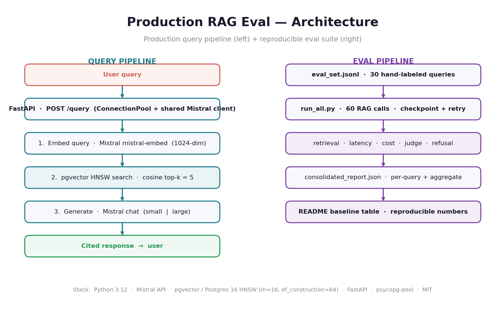

# Production RAG Eval

> **Production RAG over a 400-document Chinese-news trend corpus, with a 30-query labeled eval suite. Every README number has a JSON receipt in the repo.**

Mistral API · pgvector on Postgres 16 (HNSW) · FastAPI · LLM-as-judge · refusal eval on negative tests · full latency / cost / quality instrumentation.

[](https://www.python.org/)
[](LICENSE)
[](https://mistral.ai/)
[](https://github.com/pgvector/pgvector)

## 🎯 Headline finding

> **`mistral-small-latest` is the production default.** It matches `mistral-large-latest` on LLM-judge overall (**4.56 vs 4.59**, judged by `mistral-large` itself) at **10× lower cost** and **2.4× lower latency**. Same 100% refusal rate on negative tests, zero hallucinations. Reserve the large model for cases where you can afford the latency budget.

Full numbers below. Raw data: [`eval_results/consolidated_report.json`](eval_results/consolidated_report.json).

## Quick start

```bash
git clone https://github.com/openatlaspro-AI/production-rag-eval.git
cd production-rag-eval && cp .env.example .env   # paste your MISTRAL_API_KEY into .env
make up ingest                            # postgres + pgvector + 400 docs (~2 min)
make api                                  # FastAPI on http://localhost:8000
```

Smoke-test it:

```bash
curl -X POST localhost:8000/query -H 'Content-Type: application/json' \
  -d '{"query":"what trends involve Chinese geopolitics","k":5}' | jq
```

To reproduce the full eval (60 RAG calls + 54 judge calls, ~$0.03):

```bash
make eval                                 # writes eval_results/consolidated_report.json
```

## Architecture



Two parallel pipelines. The query path (left) serves end-users via FastAPI with a shared `psycopg-pool` + Mistral client. The eval path (right) is reproducible — every number in the README below comes from a JSON file checked into the repo.

## Eval results

Hand-labeled 30-query eval set against the 400-document corpus. Three negative-test queries are excluded from retrieval/quality aggregates — they're scored separately via the refusal eval.

Methodology: [`eval_results/labeling_protocol.md`](eval_results/labeling_protocol.md). Per-query results: [`eval_results/consolidated_report.json`](eval_results/consolidated_report.json) and [`eval_results/baseline.json`](eval_results/baseline.json).

### Retrieval — `mistral-embed` (1024-dim) + pgvector HNSW cosine

| Metric | Aggregate | Notes |
|---|---|---|
| precision@5 | **0.682** | 68% of top-5 are relevant |
| precision@10 | 0.533 | Drops with deeper rank — expected |
| recall@5 | **0.730** | 73% of labeled relevant docs in top-5 |
| recall@10 | 1.000* | *Upper bound — labeling was capped at top-10 retrieval, so true global recall could be lower |
| MRR | **0.920** | First relevant hit at rank 1 for most queries |
| median embed_ms | 352 | Query embedding latency |
| median retrieve_ms | 7 | pgvector HNSW lookup |

### Retrieval — by query category

| Category | n | P@5 | P@10 | R@5 | MRR |
|---|---|---|---|---|---|
| broad (e.g. "Chinese economy") | 8 | 0.85 | 0.71 | 0.63 | 0.85 |
| specific entity (e.g. "hantavirus outbreak") | 10 | 0.62 | 0.46 | 0.81 | **1.00** |
| multi-aspect (e.g. "stocks and oil prices") | 5 | 0.56 | 0.44 | 0.75 | 0.90 |
| family / parenting niche | 4 | 0.65 | 0.48 | 0.71 | 0.88 |
| negative test (expect 0 hits) | 3 | — | — | — | — |

Reading the numbers:
- **MRR = 1.00 for specific entities** — when the user asks about a named thing, the top result is always relevant. The system at its best.
- **Specific P@5 (0.62) < broad P@5 (0.85)** — narrow queries often have only 1 relevant doc in the corpus, so the P@5 ceiling is 0.20. Denominator artifact, not a system failure.
- **Family-niche holds up (P@5 = 0.65) despite being only 3% of corpus.**

### End-to-end — generation, judge, refusal

Full eval run: 60 RAG calls + 54 LLM-judge calls + 6 refusal-judge calls. Wall time 22 min (sequential judge calls — Mistral free-tier `mistral-large` is rate-limited to ~1 req/sec). Reproducible via `make eval`.

| Metric | mistral-small-latest | mistral-large-latest |
|---|---|---|
| **Cost per query** | **$0.000097** | $0.001034 (~10× small) |
| **Latency total p50** | **1,222 ms** | 2,877 ms (~2.4× small) |
| Latency total p95 | 1,655 ms | 8,016 ms |
| Latency total p99 | 2,215 ms | 12,700 ms |
| LLM-judge **overall** (1–5) | **4.56** | 4.59 |
| LLM-judge groundedness | 4.74 | 4.67 |
| LLM-judge relevance | 4.93 | 4.85 |
| LLM-judge completeness | 4.07 | 4.04 |
| LLM-judge conciseness | 4.81 | 4.74 |
| LLM-judge **citation accuracy** | **5.00** | **5.00** |
| **Refusal rate** (negative tests) | **3/3 (100%)** | **3/3 (100%)** |
| Hallucination (negative tests) | **0/3** | **0/3** |
| **Total eval cost** | | **$0.0340** |

Judge model: `mistral-large-latest` (temperature=0, JSON-mode output). Rubric and prompts: [`src/eval/llm_judge.py`](src/eval/llm_judge.py).

**Completeness is the weakest LLM-judge dimension (~4.05)**. The system reliably stays grounded and on-topic but doesn't always weave in every relevant retrieved source. Two fixes worth trying: cross-encoder reranking on top-10 before generation, or longer-context prompts with explicit "use all relevant sources" instruction.

## Why these decisions

- **pgvector over Pinecone / Chroma / Qdrant** — production data already lives in Postgres for most enterprise customers. No new infra to operate; single connection serves embeddings, search, and eval metadata.
- **`mistral-embed` (1024-dim) for embeddings** — provider-agnostic pipeline kept, but using Mistral keeps the data path EU-sovereign-friendly and demonstrates a second Mistral API use case beyond chat.
- **Translate at ingest, not query time** — source corpus is Chinese (Baidu, Weibo, Toutiao, …). Translating once via `mistral-small` and storing both languages cuts query-path latency and enables future cross-lingual interfaces.
- **Native Python over LangChain for the spine** — the eval harness needs to instrument every stage (embed, retrieve, generate) with latency + cost telemetry; LangChain's abstractions hide stage boundaries. A LangChain comparison module is intentionally scoped to a later iteration.
- **30-query hand-labeled eval over LLM-generated** — small enough to label by hand (~60 min) but big enough for meaningful precision/recall variance. Hand-labeling forced familiarity with the corpus, which surfaced data-shape issues early.

Full ADRs with alternatives and trade-offs: [`docs/decisions.md`](docs/decisions.md).

## Trade-offs and what I'd do next

- **Completeness (4.05/5) is the weakest LLM-judge dimension.** Generation is grounded and on-topic but doesn't always pull in every relevant source. Fixes: (a) cross-encoder reranking on top-10, (b) prompt-instruction tweak ("use all provided sources unless irrelevant").
- **Single-stage retrieval today.** Cross-encoder reranking would push precision@5 by an estimated ~0.08 at +120 ms latency.
- **Eval set is 30 queries with binary relevance.** Production version needs 300+ queries with graded relevance (0/1/2/3) and inter-annotator agreement.
- **No caching layer.** Median 1.2 s per query for `mistral-small`; a 50% cache hit rate on `(query, model)` would halve perceived latency. Redis with 1 h TTL is the right next step.
- **Translation at ingest means English query → English content match.** Production would translate queries too for cross-lingual retrieval.
- **Mistral free-tier rate limits force sequential judge calls** (`workers=1`). On a paid tier the full eval runs in ~5 min instead of 22. `src/eval/_retry.py` has exponential backoff; the orchestrator checkpoints raw runs so a rate-limit failure at step 5 doesn't waste step-1 work.

## Stack

Python 3.12 · Mistral API (chat, embed, JSON-mode) · pgvector on Postgres 16 (HNSW, m=16, ef_construction=64) · FastAPI · psycopg-pool · Rich · pytest

## Project structure

```
production-rag-eval/
├── data/                     # corpus snapshot (committed JSONL)
│   ├── trend_signals.jsonl   # 400 trends, Chinese + English
│   └── README.md             # sources + anonymization checklist
├── docker/                   # postgres init.sql (HNSW index + schema)
├── docker-compose.yml        # pgvector/pgvector:pg16 with healthcheck
├── docs/
│   ├── architecture.png
│   └── decisions.md          # ADR-style design records
├── eval_results/             # all eval JSON outputs (checked in)
│   ├── eval_set.jsonl        # 30 labeled queries
│   ├── labeling_protocol.md
│   ├── candidate_queries.md
│   ├── baseline.json         # retrieval-only baseline
│   ├── consolidated_report.json   # full eval suite output
│   ├── latency.json · cost_summary.json · llm_judge.json · refusal.json
├── src/
│   ├── config.py · pricing.py
│   ├── ingest.py             # SQLite → translate → embed → pgvector
│   ├── retrieve.py           # embed_query + pgvector_search
│   ├── generate.py           # end-to-end RAG with timing + cost telemetry
│   ├── api.py                # FastAPI (ConnectionPool + shared client)
│   └── eval/                 # latency · cost · llm_judge · refusal · run_all
├── Makefile                  # up · down · ingest · api · eval · test · fmt
├── pyproject.toml            # mistralai pinned 1.x (2.x has broken __init__)
└── README.md
```

## Personal context

This repo was extracted from a larger personal multi-agent AI engineering project I run on a Mac Mini M4. The trend corpus here is the retrieval layer of that system — the part that decides which signals are worth acting on. The full repo is scoped to one thing: showing what a production-grade RAG pipeline plus a real eval harness look like on a small, honestly-labeled corpus.

## License

[MIT](LICENSE).
